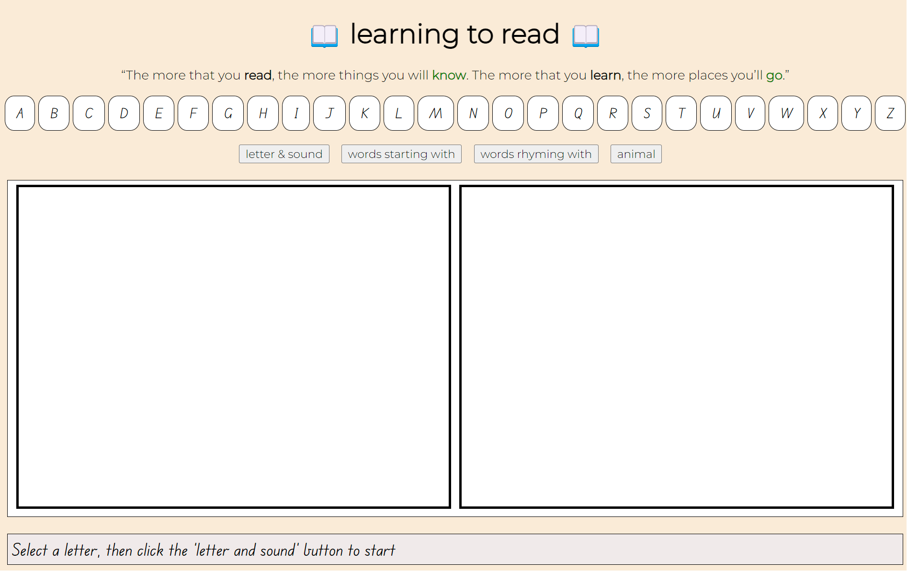

# final project - learning to read
## JSD final project

**Try it out here:** https://nickpgit.github.io/jsd-final-project/

**overview**
This app is designed to assist parents to teach pre-kinder children to read (and particular to develop 'emergent reading', the first stages of reading development). It aims to do this through: 

1. linking the sound of a letter with the letter itself
2. identifying and saying words that start with that letter, emphasizing the sound of the first letter
3. identifying words that rhyme with a particular word
4. identifying an animal whose name starts with the chosen letter
5. recognise and 'play with' the individual sounds in spoken words (phonemic awareness) . 

**How it works:** 
The app uses AJAX requests to obtain information about a clicked letter, including words that start with that letter and rhyming words. and populate the UI accordingly. The app uses the Web Speech API to say any letter or word that is clicked, for an interactive learning experience. 

In practice: 
1. The user (the child's parent) selects a letter
2. Parent to say the sound of the letter aloud and child to repeat. Recite the main word shown on the screen for that letter. Child can click on any and the program will say the word. Encourage child to repeat words and sounds
3. Parent: "what are some words that start with (letter sound)? 
4. Click 'words starting with' button to move to next page; 
5. Parent and child say those words aloud, putting emphasis on the sound of the first letter
6. Parent: "what are some words that rhyme with (the main word)? Click 'words rhyming with' button to move to next page; 
7. Parent and child say those words aloud, putting emphasis on the sound of the words and how they rhyme. Parent navigates to animal page. 
8. Parent: this animals name starts with (letter sound), which animal is it? Parent and child say name of animal, putting emphasis on the sound of the first letter
9. revisit any sections that the child did not understand or had trouble saying
10. repeat above steps for another letter (you can see which letter have already been viewed)

**screenshots:** 

**Technical hurdles:** 
- I originally used the flickr API to return images of each word when clicked, however the results were inconsistent and sometimes not appropriate, so I chose to remove this feature.
- the animal image obtained through the flickr API is sometimes not correct. I had trouble trying to find an appropriate API to get consistent images from, and also wasn't able to find one for drawings/cartoon pictures
- when deployed as a live site, the 'voice' of the speech API changes depending on the device. I tried to set the voice to 'UK female' to get an Australian-sounding accent. I removed setting the voice and instead let it default to 'US male' to ensure it says words correctly
- I struggled with overthinking the possibilities of what the app could do
- I was unable to find a way to make the app say the sounds of letters
- I was unable to work out how to clean up the code for the 

**What I learned**
- I needed to have more definite plans for the app before creating it. This will keep me on track and help me not get bogged down in the various directions I could take the app in 
- API results can be very inconsistent and sometimes the results data needs to be filtered. Some of the images and words were inappropriate

**Technology that we haven't covered in class:** 
The Web Speech API - I used this inbuilt browser API to 'say' the words or letters that were clicked. I was limited by the voices changing across devices, which meant that I had to use the default american voice rather than a more relevant voice for Australian users. 

**future features** 
- find a way for the app to say the sounds of the letters, not just the name of the letter
- use speech recognition to check whether the child says the sound of the letter or says the word correctly 
- make this into an actual game, to make it more engaging, with cartoon characters, letters that move around the screen, allowing the child to interactively experiment with the sounds of letter, perhaps allowing them to join letters or sounds together to form new sounds and words. 
- research the reading teaching methods further, to be more clear about exactly how the app should be used by parents to teach children. 
